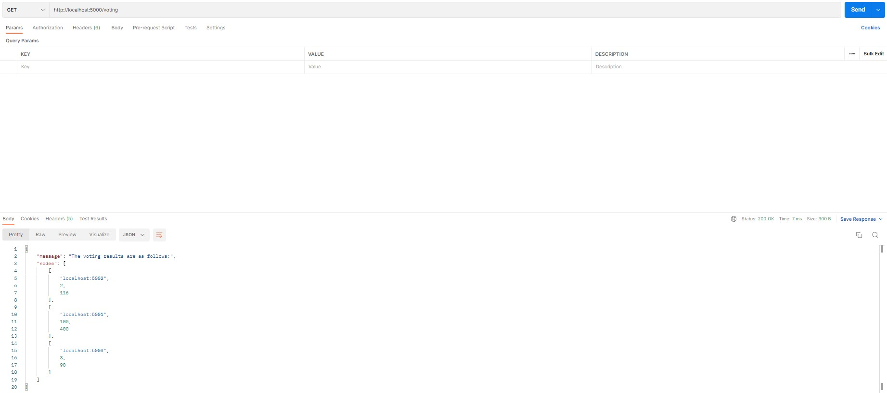
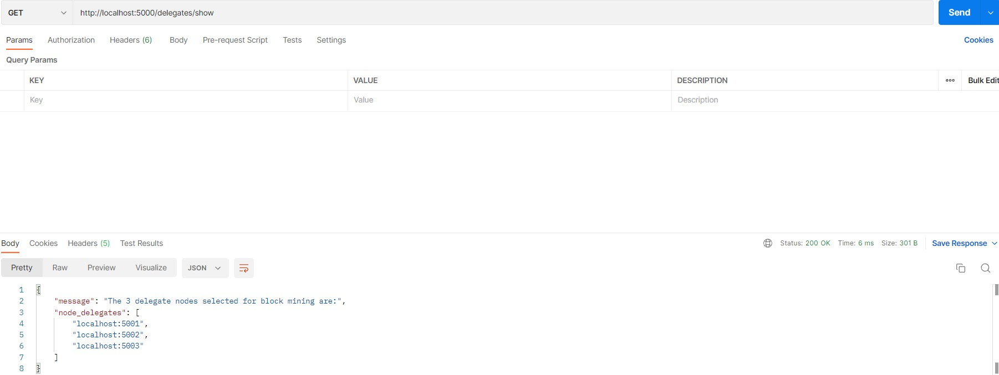
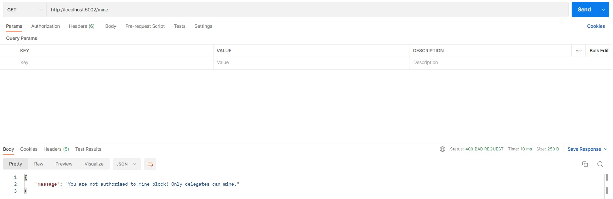
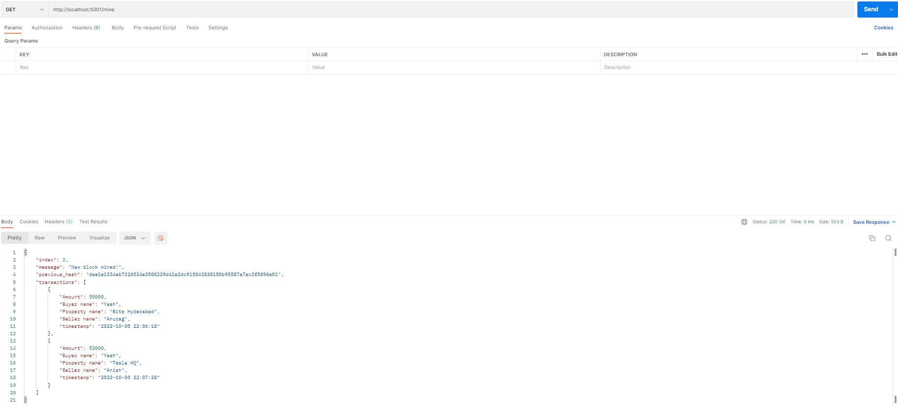

# Blockchain Assignment - 1

## How to run
1) Make sure Python 3.8+ , Flask and requests library is installed.
    *  If not downloaded, Download any version of Python (>=3.8) from the [official website](https://www.python.org/downloads/).
    *  Install flask   => `pip install flask`
    *  Install request => `pip install requests`

2) `cd Code` and run the server:
    * `py main.py`
        We can open different network ports on different terminals to simulate multinode network
    * `py main.py -p 7001`
    * `py main.py -p 7002`

3) Run the API endpoints on a browser or a HTTP Client like [Postman](https://www.postman.com/downloads/).

## Objective
* This assignment focuses on implementing the consensus algorithm - __Delegated Proof of Stake__ in the context of a Land Management System.

## Delegated Proof of Stake (DPoS) algorithm 
DPoS is a reliable, robust, scalable and efficient consensus algorithm in Blockchain technology. It is an innovation over standard Proof of Stake (PoS). In DPoS, each node that has a stake in the system can delegate the validation of a transaction to other nodes by voting.

Here, in DPoS, user's vote weight is proportional to their stake rather than block mining being tied to the stakeholders' total tokens.

### Methods in `blockchain.py`

* `localhost:7000` is used as the primary node which takes care of adding new nodes, maintaining stakes of nodes and conducting the election process to choose 3 delegate nodes which are authorised to validate transactions and mine new blocks.

* There is no upper limit on how many nodes can be added to the network, however, only 3 nodes will be chosen as delegate nodes after the voting process.

* Simulation of the voting process is done by randomly assigning votes between 0 and 100 using the `randint()` function in python.
    * Snippet of voting method of Blockchain class implemented in `blockchain.py`
    ```
 
    ```
* The election process is based on the stakes and votes of all the stakeholders, selecting the top 3 nodes with the highest `(stakes*votes)` values.
    * Snippet of the delegated selection implemented in Blockchain class in `blockchain.py`
    ```

    ```

* The primary node (localhost:5000) generates the delegate list and all other nodes can view the elected delegates. For this we have a sync().
    * Snippet of sync method implemented in Blockchain class in `blockchain.py`
    ```

    ```

### API endpoints to interact with our blockchain

1). `/nodes/add`

The first step in initialising the network is to add the nodes along with their stakes. This is done by a POST route. The URL of the nodes along with their stakes need to be added one at a time. This endpoint needs to be run from all ports before beginning any transaction in the blockchain.


2). `/voting`

Voting is done using a GET route. Voting can only be conducted by the primary node (`localhost:7000`), and all other nodes receive an error message. Once called, a JSON response which consists the address of the node, stake of the node and the value of (stake * votes) corresponding to the nodes is sent to the primary node.

Voting results showing address, stake and (votes * stake) of all participating nodes


Nodes apart from the primary node receive an error message.


3). `/delegates/show`

This GET route sends all the delegates elected for mining to be viewed to the primary node.



4). `/delegates/sync`

This GET endpoint allows all the other nodes in the network to also fetch the list of delegate nodes.


5). `/transactions/new`

This POST method initiates a new transaction and requires the user to enter the customer name, item name and total billing amount in JSON format.


6). `/mine`

This GET endpoint facilitates validating transactions and mining new blocks. Adhering to the DPoS consensus, only delegate or validator nodes can mine the new blocks.To ensure no block goes underfilled, a new block can be mined only when there are atleast two unverified transactions.

This error message will be received by a non-delegate node that tries to mine a new block.


There must be atleast 2 transactions per block


Structure of a typical block mined by a delegated node


7). `/chain`

This GET method facilitates the user to view the entire blockchain and its length.


8). `/chain/resolve`

This endpoint finds the longest validated chain by checking all the neighbouring nodes in the network and sets it as the primary blockchain.
